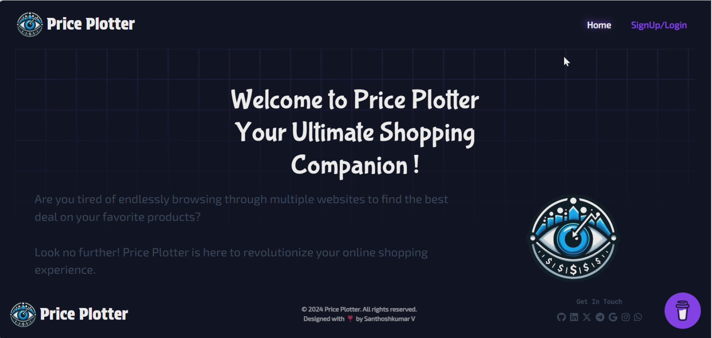
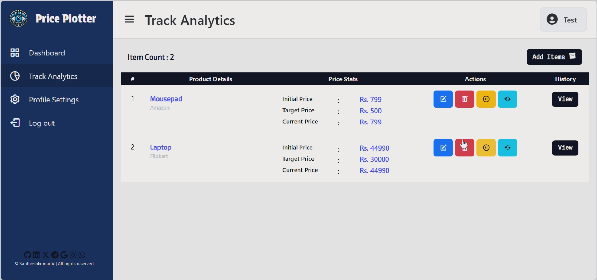

# Price Plotter

**Your Ultimate Price Tracker!**

Price Plotter is here to revolutionize your online shopping experience.

## Table of Contents

- [Features](#features)
- [Why Choose Price Plotter?](#why-choose-price-plotter)
- [Getting Started](#getting-started)
- [Configuration](#configuration)
- [Contributing](#contributing)
- [License](#license)
- [Disclaimer](#disclaimer)
- [Support Me](#support-me)

## Features

- **Multi-Retailer Price Tracking:** Monitor prices from Amazon, Flipkart and other leading platforms (coming soon) simultaneously.
- **Daily Price Updates:** Get instant notifications when prices drop, ensuring you never miss out on a great deal.
- **Price Drop Alerts:** Set personalized price drop alerts for individual products, so you can buy at the perfect time.
- **Historical Price Data (coming soon):** Access historical price data to track product trends and make informed buying decisions.
- **Simplified Product Comparison:** Easily compare prices across multiple retailers to find the best deal for your desired product.




## Why Choose Price Plotter?

- **Save Time:** Say goodbye to endlessly scrolling through multiple websites. Price Plotter brings all the information you need right to your fingertips.
- **Save Money:** With our price tracking and alert system, you'll never overpay for a product again. Get the best deals and maximize your savings.
- **Stay Informed:** Our comprehensive platform keeps you updated on price fluctuations and trends, empowering you to make smart purchasing decisions.

## Getting Started
```bash
# Clone the repository
git clone https://github.com/Santhoshkumar2298/PricePlotter.git

# Change directory
cd PricePlotter

# Install Requirements
pip install -r requirements.txt

# Run server.py
python server.py
```

## Configuration
Before running Price Plotter Locally, users need to create and config the .env file:

- Create .env file in project root folder and make the config as shown below:

```python
MY_EMAIL=YOUR_EMAIL_ID #Replace with your email id
MY_PASSWORD=YOUR_EMAIL_APP_PASSWORD # Replace with email smtp service password
CSRF_SECRET=YOUR_SECRET_KEY # Replace with your secret key (anything)
DB_URI=YOUR_SQL_DB_URI # Replace with your sql db uri
```

- Make the above configuration without any extra spaces in .env file
- For Email App Password, Check this article to know how to get the MY_PASSWORD for smtp google server configuration:
  - https://www.getmailbird.com/gmail-app-password/

## Contributing
If you'd like to contribute to the project, please follow the [contributing guidelines](CONTRIBUTING.md)

## License
This project is licensed under the [MIT License](LICENSE.md).

## Disclaimer
Price Plotter is not affiliated with Amazon, Flipkart, or any other third-party retailers mentioned. All product names, logos, and brands are property of their respective owners.

## Support Me

If you find my work helpful or inspiring and would like to support me, you can buy me a coffee!

[](https://www.buymeacoffee.com/santhoshkumar2298)

Your support is greatly appreciated!
